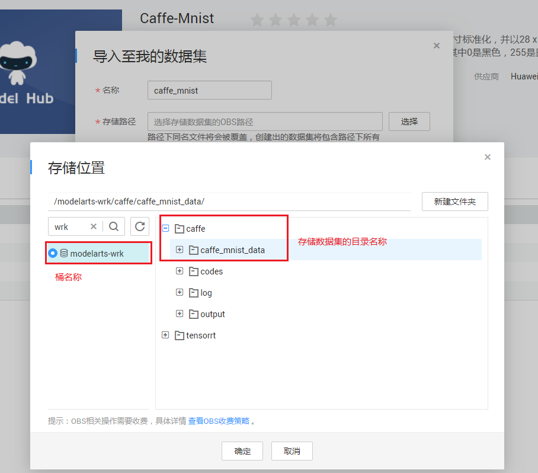
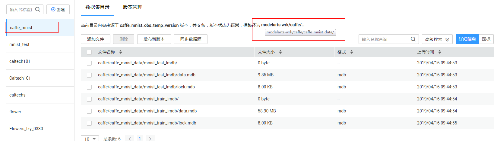
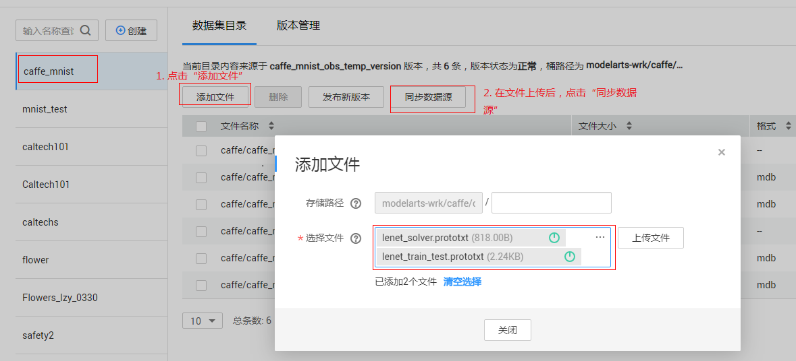
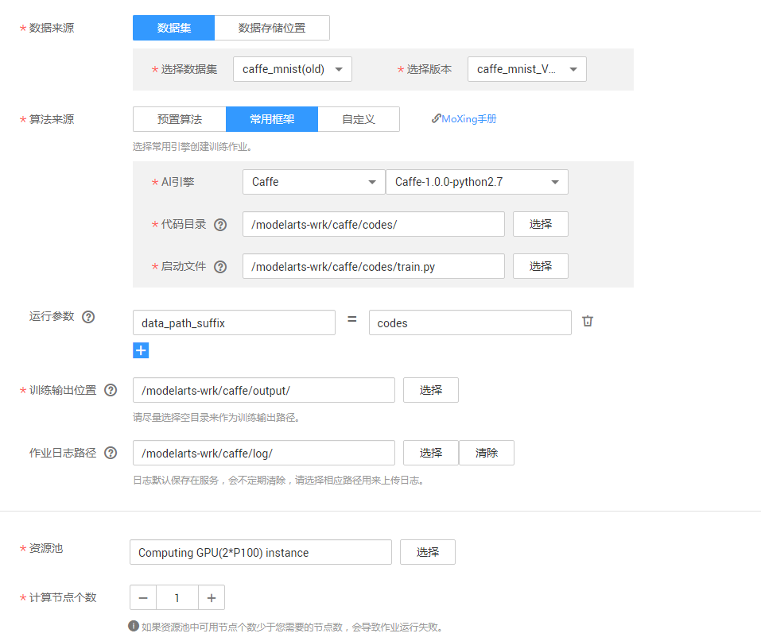
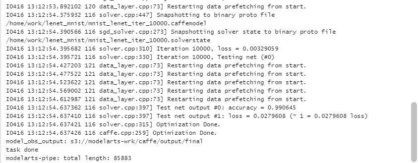
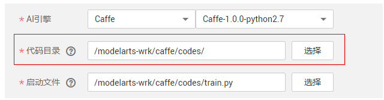

# 使用Caffe实现手写数字图像识别应用

本文介绍在华为云ModelArts平台如何使用Caffe实现MNIST数据集的手写数字图像识别应用。本案例参考Caffe官方文档[Training LeNet on MNIST with Caffe](http://caffe.berkeleyvision.org/gathered/examples/mnist.html)。操作的流程分为3部分，分别是：

基本流程包含以下步骤：

1. **准备数据**：数据集格式转换，然后上传至OBS桶中。
2. **编写模型**：编写prototxt文件定义网络结构和配置网络训练时各种参数，然后上传至OBS桶中。
3. **训练模型**：使用ModelArts服务，新建训练作业进行模型训练。


### 1. 准备数据
通过ModelArts市场预置数据集导入所需数据集版本，具体操作如下：

**步骤 1**  &#160; &#160; 登录[ModelArts](https://console.huaweicloud.com/modelarts/?region=cn-north-1#/manage/dashboard)管理控制台，在“全局配置”界面添加访问秘钥。请参考下图。


**步骤 2**  &#160; &#160; 返回ModelArts管理控制台，单击左侧导航栏的“市场”。 切换到ModelArts市场的“数据集”页面，找到数据集“Caffe-Mnist”。

**步骤 3**  &#160; &#160; 进入到该预置数据集“Caffe-Mnist”的详情页面，执行“导入到我的数据集”操作，页面会自动跳转到“数据管理>数据集”页面进行创建。在执行“导入到我的数据集”操作时，需要指定到具体目录，即`s3://桶名/目录名`，不可以只指定到桶`s3://桶名`。



**注：在执行“导入到我的数据集”操作时，需要指定到具体目录，即`s3://桶名/目录名`，不可以只指定到桶`s3://桶名`。本案例中OBS的路径为`s3://modelarts-wrk/caffe/caffe_mnist_data`，桶名为`modelarts-wrk`，最后一级目录名称为`caffe_mnist_data`，**

**步骤 4**  &#160; &#160; 在ModelArts管理控制台的“数据管理>数据集”页面查看直到mnist数据集（caffe-mnist）创建完成，数据详细信息完全加载。

**步骤 5**  &#160; &#160; 在数据集目录页面获取创建的mnist数据集的桶信息“modelarts-wrk/caffe/caffe-mnist/”。请参考下图。




### 2. 编写模型
接下来，要编写prototxt文件定义网络结构和配置网络训练时各种参数（本案例中已编写好了相应文件），并编写启动训练的python脚本，操作步骤如下：

**步骤 1**  &#160; &#160; 编写定义网络结构的prototxt文件<a href ="https://github.com/BVLC/caffe/blob/master/examples/mnist/lenet_train_test.prototxt">lenet_train_test.prototxt</a>和配置训练时参数的prototxt文件<a href ="https://github.com/BVLC/caffe/blob/master/examples/mnist/lenet_solver.prototxt">lenet_solver.prototxt</a>，官网提供具体文件，但需要对路径相关参数进行修改（本案例已经对prototxt文件修改，并存放在当前目录下“train”文件夹中）。

**步骤 2** &#160; &#160; 将编写好的prototxt文件和python脚本上传到OBS桶中（ModelArts中训练程序的总大小不能超过10M，由于定义网络结构的prototxt文件可能较大，可以放到数据集的OBS目录，具体操作参考**步骤3**；本案例将prototxt文件放到代码OBS目录`s3://modelarts-wrk/caffe/codes`）。

**步骤 3（可选）**  &#160; &#160; 如果将prototxt文件放到数据集目录下，在“ModelArts”管理控制台的“数据管理>数据集”页面选择数据集，并点击“数据源同步”。或者可以直接操作OBS，将prototxt文件放到`s3://modelarts-wrk/caffe/caffe_mnist_data`目录下。



**步骤 4**  &#160; &#160; 利用[OBS Browser](https://obstool-north.obs.myhwclouds.com/browser/hec/win64/OBSBrowser.zip)创建桶，并参考<a href = "https://support.huaweicloud.com/usermanual-dls/dls_01_0040.html">“上传业务数据”</a>章节内容，将启动训练的python脚本和prototxt文件上传到OBS桶中（注意路径中不要出现中文；本案例中已编写好了训练脚本[train.py](codes/train.py)）。

### 3. 训练模型
最后，利用已经上传的数据集和训练程序脚本完成模型训练，操作步骤如下：

**步骤 1**  &#160; &#160; 在“训练作业”界面，单击左上角的“创建”，可参考下面图片填写训练作业参数。 
(1) “名称”和“描述”可以随意填写；
(2) 设置”数据来源“，通过“数据集”选择已经导入的数据集`caffe_mnist`{或者通过“数据存储位置”进行设置,本例中OBS路径为`s3://modelarts-wrk/caffe/caffe_mnist_data`}；
(3) AI引擎选用`Caffe`；
(4) 点击“增加运行参数”按钮，添加程序运行时需要的参数；
(5) 选择“训练输出位置”和“资源池”等参数。



运行参数说明：

1. train_url（训练输出路径）：模型输出OBS路径；在ModelArts平台中选中“训练输出位置”后，平台会自动添加`train_url`参数。

2. data_url：数据集OBS路径；在ModelArts平台中选中“数据来源”后，平台会自动添加`data_url`参数。

3. num_gpus：使用gpu数目；在ModelArts平台中选中“资源池”后，平台会根据资源池中GPU数目，自动添加`num_gpus`参数。

4. data_path_suffix：代码目录的最后一级目录名称。例如：本案例中代码OBS目录为`s3://modelarts-wrk/caffe/codes`，则`data_path_suffix`为`codes`。

**步骤 2**  &#160; &#160;  参数确认无误后，单击“立即创建”，完成训练作业创建。训练作业完成后，即完成了模型训练过程。如有问题，可点击作业名称，进入作业详情界面查看训练作业日志信息。运行成功日志如下图所示。



### 4. 备注

##### 4.1 caffe执行命令解析
本案例中通过python脚本调用caffe编译后的二进制文件启动训练作业，caffe编译后的二进制文件路径为`/home/work/caffe/bin/caffe.bin`，对应文件`train.py`中代码如下。

     ```python
     cmd = '/home/work/caffe/bin/caffe.bin train  -solver {}'.format(solver_file)
     if gpu_nums:
       gpus = ','.join('%s' %id for id in range(gpu_nums))
       cmd += ' -gpu {}'.format(gpus)
     print('cmd: ' + cmd)
     os.system(cmd)
     ```

其中`solver`参数指定prototxt文件`lenet_train_test.prototxt`，`gpu_nums`指定GPU显卡的数目，如果是CPU模式，则不添加该参数

##### 4.2 代码和数据集下载

###### 4.2.1 代码下载

在本案中选择的代码OBS路径为`s3://modelarts-wrk/caffe/codes`，如下图所示，则平台会自动将代码会下载到`/home/work/user-job-dir/codes/`目录下。



```
1. OBS代码路径结构
modelarts-wrk
    |-caffe
        |-codes
            |-train.py
            |-lenet_solver.prototxt
            |-lenet_train_test.prototxt
             
2. 本地代码路径结构
home
    |-work
        |-user-job-dir # "/home/work/user-job-dir"为固定路径不会改变
            |-codes # “代码目录”改变时，该级目录名称会根据“代码目录”的最后一级目录名称相应改变
                |-train.py
                |-lenet_solver.prototxt
                |-lenet_train_test.prototxt
```

其中`/home/work/user-job-dir`为固定目录，`codes`对应OBS目录的最后一级目录名称。

###### 4.2.2 数据集下载

在本案中选择的数据集OBS路径为`s3://modelarts-wrk/caffe/caffe_mnist_data`，平台不会自动下载数据集，需要用户调用`mox.file.copy_parallel`下载数据集，对应`train.py`中相关代码如下所示。

```pyton
# 1. 创建本地数据集目录
local_dataset_url = args.data_local_path
if not os.path.exists(local_dataset_url):
  os.makedirs(local_dataset_url)
print('local_dataset_url: ' + local_dataset_url)

# 2. 检查数据集的OBS路径是否存在并下载
if mox.file.exists(data_url):
  print("data obs url exists")
  mox.file.copy_parallel(src_url=data_url, dst_url=local_dataset_url)
```

其中本地数据集目录对应参数`data_local_path`，默认值为`/home/work/dataset`。由于本地`/home/work`目录下存储空间有限，对于较大的数据集建议下载到`/cache`目录下。

##### 4.3 prototxt文件中固定路径

   本案例在prototxt文件中填写某些固定路径，因此在填写参数时，需要注意和prototxt文件中路径的对应关系。

###### 4.3.1 `lenet_train_test.prototxt`文件路径配置

​    在`lenet_solver.prototxt`文件中，参数`net`对应的值为`lenet_train_test.prototxt`文件的本地路径。在`4.2.1`章节中已经提到，平台会自动将代码路径下的代码下载到本地，本案例中本地代码路径为`/home/work/user-job-dir/codes`，因此`lenet_train_test.prototxt`文件的本地路径`/home/work/user-job-dir/codes/lenet_train_test.prototxt`。`lenet_solver.prototxt`文件中配置如下所示。

```
# The train/test net protocol buffer definition
net: "/home/work/user-job-dir/codes/lenet_train_test.prototxt"
```

​    如果将prototxt文件上传到数据集的OBS路径下，并调用`mox.file.copy_parallel`下载到`/home/work/dataset`路径下，则`lenet_solver.prototxt`文件中配置如下所示。

```
# The train/test net protocol buffer definition
net: "/home/work/dataset/lenet_train_test.prototxt"
```

###### 4.3.2 数据集的路径配置

​    在`lenet_train_test.prototxt`文件中，需要对训练集和测试集的数据集路径进行配置。在`4.2.2`章节中已经提到，数据集需要用户调用`mox.file.copy_parallel`下载，在本案例中`data_local_path`采用默认值`/home/work/dataset`，则数据集被下载到`/home/work/dataset`目录下

```
1. 数据集OBS路径结构
modelarts-wrk
    |-caffe
        |-caffe_mnist_data
            |-mnist_train_lmdb
                ...
            |-mnist_test_lmdb
                ...
             
2. 数据集本地路径结构
home
    |-work
        |-dataset
            |-mnist_train_lmdb
                ...
            |-mnist_test_lmdb
                ...
```

`lenet_train_test.prototxt`文件中数据集的路径配置，如下所示。

```
name: "LeNet"
layer {
  name: "mnist"
  type: "Data"
  top: "data"
  top: "label"
  include {
    phase: TRAIN
  }
  transform_param {
    scale: 0.00390625
  }
  data_param {
    source: "/home/work/dataset/mnist_train_lmdb" # 训练集数据路径
    batch_size: 1024
    backend: LMDB
  }
}
layer {
  name: "mnist"
  type: "Data"
  top: "data"
  top: "label"
  include {
    phase: TEST
  }
  transform_param {
    scale: 0.00390625
  }
  data_param {
    source: "/home/work/dataset/mnist_test_lmdb" # 测试集数据路径
    batch_size: 512
    backend: LMDB
  }
}
... ...
```

###### 4.3.3 本地保存模型路径

在`lenet_solver.prototxt`中配置模型的保存路径和保存模型文件的名称，本案例中本地保存模型的路径为`/home/work/lenet_mnist/`，模型名称为`mnist_lenet`，代码如下所示。

```
snapshot_prefix: "/home/work/lenet_mnist/mnist_lenet"
```

将模型保存到OBS，需要用户调用`mox.file.copy_parallel`将本地保存模型拷贝到OBS中，因此在调用API执行拷贝时，参数`model_local_path`要和模型的本地保存路径相对应，即和`lenet_solver.prototxt`中`snapshot_prefix`指定路径相对应，相关代码如下所示。

```python
# 定义保存模型函数，默认10分钟保存一次，可以通过interval参数设置保存间隔
def save_inter_model(src_url, dst_url, interval=10):
  save_num = 1
  while True:
    time.sleep(interval * 60)
    model_dst_url = os.path.join(dst_url, str(save_num))
    print("copy inter model from {} to {}".format(str(src_url), str(model_dst_url)))
    mox.file.copy_parallel(src_url=src_url, dst_url=model_dst_url)
    save_num = save_num + 1

# 启动单独进程，将训练过程中保存模型，拷贝到OBS中。方便在精度满足要求时，可以停止训练
inter_save_process = multiprocessing.Process(target=save_inter_model, args=(model_local_output, model_obs_output, 1))
inter_save_process.start()
       
# 执行训练过程
cmd = '/home/work/caffe/bin/caffe.bin train  -solver {}'.format(solver_file)
if gpu_nums:
  gpus = ','.join('%s' %id for id in range(gpu_nums))
  cmd += ' -gpu {}'.format(gpus)
print('cmd: ' + cmd)
os.system(cmd)

# 停止拷贝训练过程中模型进程
inter_save_process.terminate()


# 将训练结束后最终得到的模型保存到OBS中
model_obs_output = os.path.join(model_obs_output, "final")
print("model_obs_output: " + model_obs_output)
if not mox.file.exists(model_obs_output):
  mox.file.make_dirs(model_obs_output)
mox.file.copy_parallel(src_url=model_local_output, dst_url=model_obs_output)
```

###### 4.3.4 CPU模式下运行

​    本案例需要在`GPU`模式下运行。在`CPU`模式下运行，需要将`lenet_solver.prototxt`文件中`solver_mode`改成`CPU`。
