# 使用MXNet实现Caltech图像识别应用

本实验介绍在华为云ModelArts平台如何使用深度学习框架MXNet训练Caltech数据集，并把得到的模型发布成一个可用的推理服务。

基本流程包含以下步骤：

1. **准备数据**：下载数据集，上传至OBS桶中。
2. **训练模型**：使用MXNet原生接口编写模型训练脚本，新建训练作业进行模型训练。
3. **部署模型**：得到训练好的模型文件后，新建预测作业将模型部署为在线预测服务。
4. **发起预测请求**：下载并导入客户端工程，发起预测请求获取预测结果。

MXNet框架介绍：Apache MXNet是一个开源深度学习软件框架，可用于训练和部署深度神经网络。它具有很高的可扩展性，支持命令式和符号式编程，并支持多种编程语言，包括C ++，Python，Julia，Matlab，JavaScript，Go，R，Scala，Perl和Wolfram语言。

MXNet的优势：性能比起tensorflow等语言而言更好，支持的语言更多，比起caffe等框架更省内存。

MXNet的典型项目：人脸识别冠军项目InsightFace，参见链接https://github.com/deepinsight/insightface。

### 1. 准备数据

数据集介绍： Caltech101数据集是加利福尼亚理工学院提供的101类（加一个背景类）开源图像数据集，每一类大约有40~800张左右的图片，每张图片是接近300×200大小不等的。关于该数据集详细可以参见http://www.vision.caltech.edu/Image_Datasets/Caltech101/#Description。

本实验不需要下载该数据集，通过下载市场里共享的数据集到自己的OBS（对象存储容器）中，具体操作如下：

**步骤 1**  &#160; &#160; 添加AK/SK，为了能正常使用存储功能，需要添加账户的AK/SK，登录“[ModelArts](https://console.huaweicloud.com/modelarts/?region=cn-north-1#/manage/dashboard)”管理控制台，在“全局配置”界面添加访问秘钥。如图:

**步骤 2**  &#160; &#160;完成AK/SK添加后，从链接https://10.175.38.120/xuchao6/dataset/caltech101.zip 下载数据集，并将数据集解压到本地，会得到一个caltech101的文件。

数据集解释：该数据集分为两部分，

一部分是original_files中的图片，这是下载的开源数据集解压后得到的，我们一般称之为原始图片，

另一部分mxnet_format是为了方便进行预处理操作，已经制作好了MXNet使用的rec文件。这里需要说明的是，在深度学习领域，训练之前一般会把数据集按6:2:2的比例分成训练集、验证集和测试集。训练集就是我们训练时使用的数据集，验证集是在训练过程中评估模型好坏的数据集，测试集是在训练完成以后评估模型的数据集。这里我们不需要评估模型最终的结果如何，所以没有使用测试集，按8:2分成了训练集和验证集。train是训练集，val是验证集。这里还有lst文件和idx文件，lst文件里是图片路径的list，即train和val数据集里各有哪些图片。详细制作方法参见https://mxnet.incubator.apache.org/versions/master/faq/recordio.html?highlight=rec%20file。

**步骤 3**    &#160;上传数据集到obs，下载obs-browser并使用obs-browser上传代码到obs。点击链接https://storage.huaweicloud.com/obs/?region=cn-north-1#/obs/buckets 并登录自己的华为云账号，选择适合的下载。

图1.2 下载obs-browser

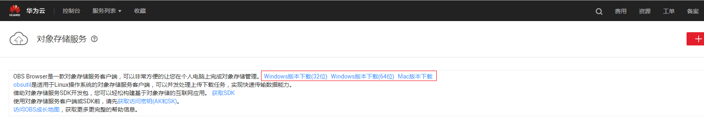

下载好的obs-browser是一个压缩包，将里面所有的文件解压，然后点击obs.exe运行。在打开的界面右上角添加账户，账户名可任意填写，AccessKeyID和SecretAccessKey就是在准备数据前添加的AK/SK。

图1.3 obs-browser添加账号

将caltech101整个文件上传至OBS桶中并等待右上角云标志传输完成。

图1.4 上传文件至OBS

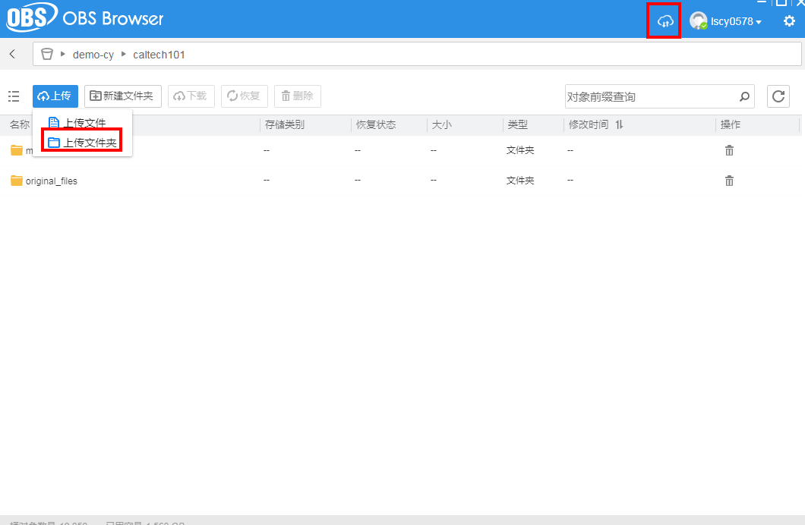

### 2. 训练模型

训练算法介绍：本实验使用了深度卷积神经网络resnet进行了训练，resnet的卷积层个数可选为18,34,50。在可选的18,34,50情况下，模型层数越大，代表模型越深，训练所需的时间越长，模型准确率能更好。resnet是常用的图像分类卷积神经网络之一，在codes目录下有resnet18的网络结构图plot.gv.pdf。

接下来，将训练代码上传到OBS中，并完成模型训练，操作步骤如下：

**步骤 1**  &#160; &#160; 从github上下载该完整工程，codes就是我们用到的训练代码。点击给的目录链接的上一级目录。

图2.1 回到下载整个项目的上一级目录

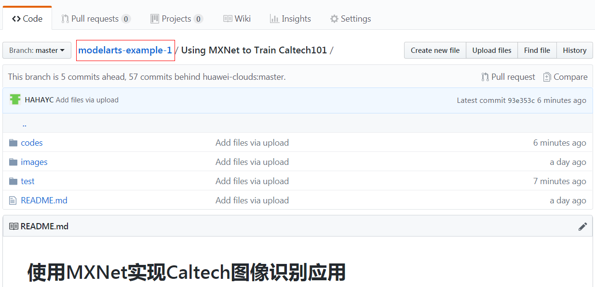

然后点击右上角的Clone or download选择download zip下载项目的压缩包，最后把项目中的Using MXNet to Train Caltech101解压到本地。

图2.2 下载项目并解压Using MXNet to Train Caltech101

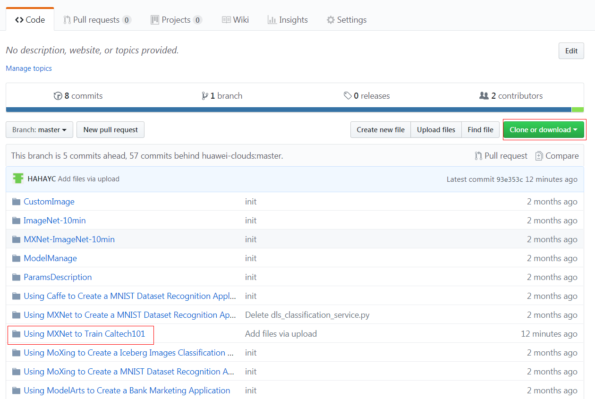

**步骤 2** &#160; &#160; 上传数据集代码，把代码目录codes整个上传到obs里。**注意：从第一步下载的数据不要和代码文件放在同一个目录下**，**且不要更改codes目录的名称**。

图2.3 上传codes到obs

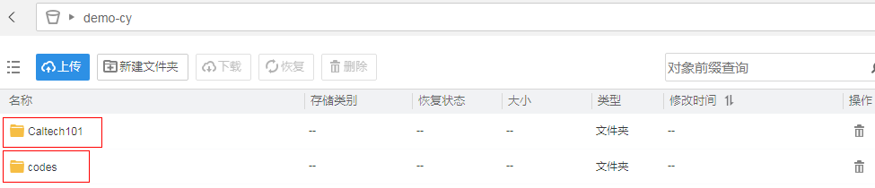

**步骤 3**  &#160; &#160; 在“训练作业”界面，单击左上角的“创建”，参考图2.4填写训练作业参数。 “名称”和“描述”可以随意填写；“数据来源”请选择数据集里从市场导入的Caltech101所在的桶路径；计算节点规格选用计算型GPU（P100实例）；**AI引擎选用mxnet。**

图2.4 训练作业参数配置

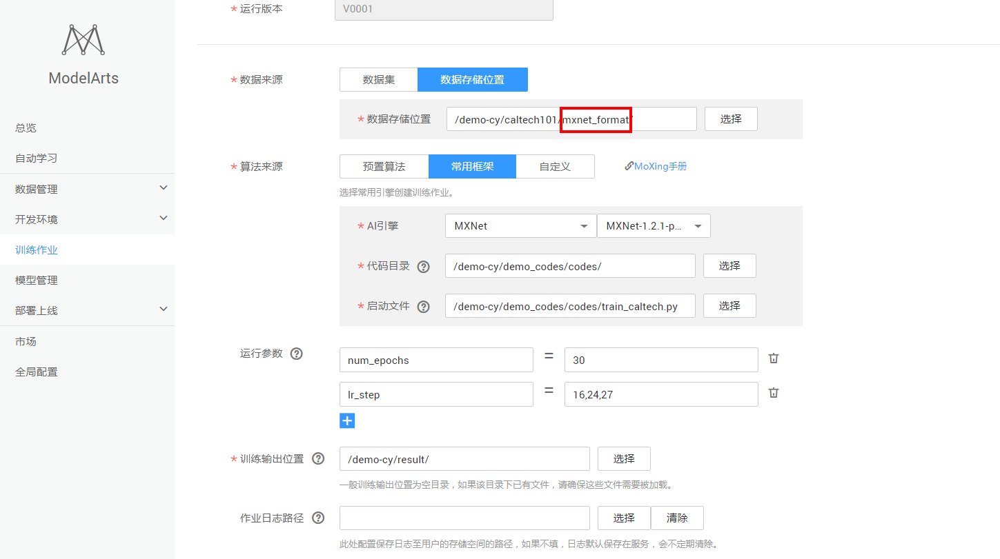

注意数据集位置要选到mxnet_format目录下，可以在运行参数中填写可选运行参数，说明如下。

可选运行参数说明：

1. num_epochs：int，训练需要迭代的次数，默认30；
2. batch_size：int，训练的每次更新包含的样本数量大小， 默认128；
3. lr：float，学习率，默认0.1；
4. lr_step: str，学习率减小的epoch，默认为‘16,24,27’，也就是说学习率会在第16个epoch结束时减小为原来的0.1倍，为0.01，第24,27epoch同理；
5. num_layers：int，resnet模型的卷积层数，可供选择的有18,34,50，默认为34；
6. disp_batches：int，每隔多少步输出一次，默认20；

**步骤 4**  &#160; &#160;  参数确认无误后，单击“立即创建”，完成训练作业创建。等待训练作业完成后会显示运行成功，就完成了模型训练过程。如有问题，可从训练作业界面点击作业名称，进入作业详情界面查看训练作业日志信息。

### 3. 部署模型

模型训练完成后，可以创建预测作业，将模型部署为在线预测服务，要部署成推理服务需要上传推理代码和配置文件，操作步骤如下：

**步骤 1**  &#160; &#160; 上传需要的推理代码和config.json文件。这两个文件存放在codes目录下，分别叫customize_service.py和config.json。将这两个文件上传至输出路径的model目录下。

图3.1 上传推理代码和config.json文件

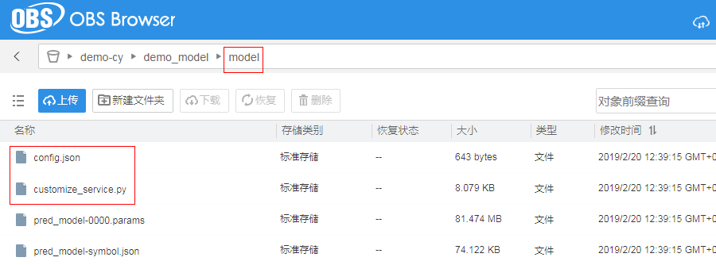

**步骤 2**      在“模型管理”界面，单击左上角的“导入”，参考图3.2填写参数。

图3.2 导入模型参数配置

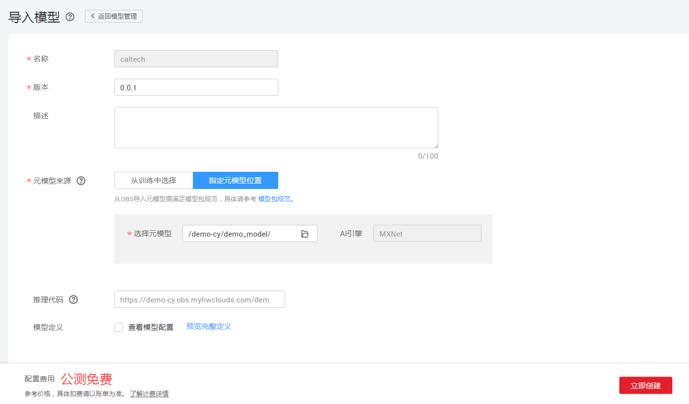

其中元模型的路径需要设置为model文件所在文件夹的上一层文件夹，比如图3.1红框的路径的父目录：demo_model为之前训练作业的输出路径。

或者直接从训练作业创建模型。注意：必须要上传推理代码和config配置文件后才能成功导入。

图3.3 从训练作业导入模型

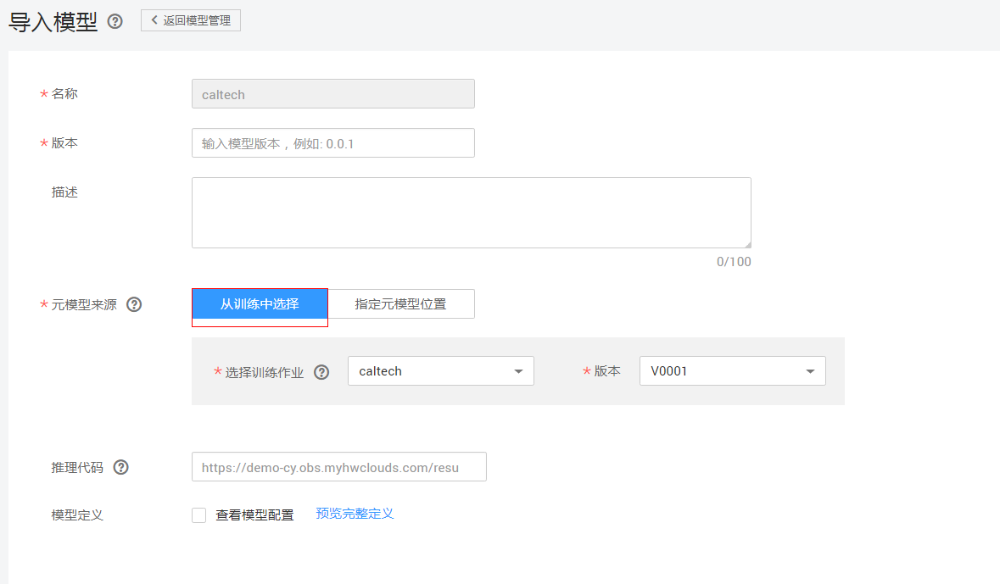

**步骤 2**  &#160; &#160; 参数确认无误后，单击“立即创建”，完成模型创建。

当模型状态为**“正常”**时，表示创建成功。单击部署-在线服务，创建预测服务。

3.4 部署在线服务

输入任意名称后，直接点击下一步然后创建在线服务，注意：计算节点规格这里使用cpu已足够满足本实验的需求，如果有其他需要，比如物体检测的项目建议使用1*P4的gpu规格。

### 4. 发起预测请求
完成模型部署后，等待服务部署完成显示运行中就可以开始进行预测了。在部署上线-在线服务界面可以看到已上线的预测服务名称，点击服务名称可以进入服务测试在线预测，如图4.1。

图4.1 在线服务测试

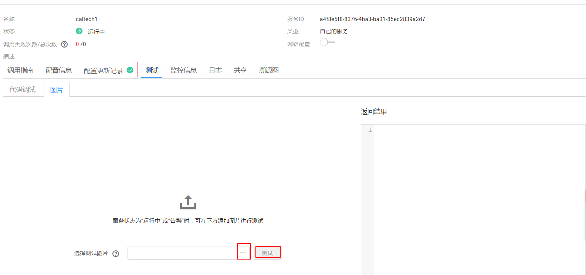

点击测试->图片进入上传图片的测试界面。单击"···"选择本地的图片上传后点击测试，在右侧会输出预测的结果。如图4.2测试的是一张笔记本电脑的图片观察模型是否能将它归类正确：

图4.2 测试一张笔记本电脑的图片

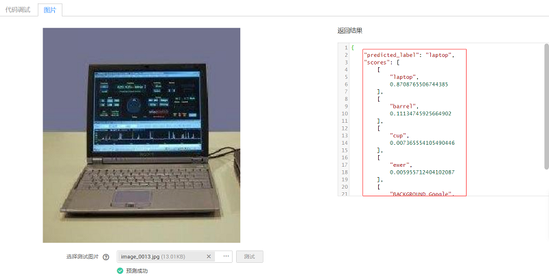

输出说明：

predicted_label：是这个模型最终认为这张图片的归类，这里我们可以看到输出的是“labtop”也就是笔记本电脑，所以这张图片能够被这个模型预测正确。

scores：置信度，也就是模型认为这张图片属于某一类的概率。这里会输出概率最高的前五项，这是在网络的最后一层加入了softmax层转化来的。

**注意：启动了推理服务完成了测试之后一定要及时点击右上角的停止按键停止服务，防止一直启动造成账号欠费。**

本实验到这里就已经结束了，如果你希望学习更多和深度学习相关的方法或者想亲自试试深度学习训练过程的调参，可以继续往下看，当然如果不感兴趣也可以跳过。

### **提高：**

当然，并不是所有的图片都能够预测正确，比如本实验如果使用的全都是默认的参数去进行训练，在验证集上差不多只有78%左右的准确率。当然，如果对结果不满意，或者想自己尝试让深度学习的模型效果更加好，可以调节下列参数num_epochs；batch_size；lr；lr_step；num_layers；（参数说明见2.训练模型的步骤3）。在训练日志中，每个epoch结束都会输出模型当前在验证集上的表现，如图1-1所示，可以通过这些的变化来观察改动了上述参数后对训练模型有什么样的影响。
图1-1 训练输出日志

几项指标值的解释：

Validation-accuracy: 预测的置信度最高的类别是正确的比例，即上述推理测试时输出predicted_label正确占总预测结果的比例，结果越高，模型越好。在深度学习领域一般称为top-1；

Validation-cross-entropy: 交叉熵，用来评判对每一类预测准确率的损失值，越小越好；

Validation-top_k_accuracy_5: 预测的置信度最高的前5类中如果有正确的那一类，就认为这次预测是正确的。在深度学习领域一般称为top-5，同样，结果越高，模型越好。

这里数值的改变可能并不能提供一个直观的模型效果提升，在项目Using MXNet to Train Caltech101下有一个test文件夹，里面有一些测试图片。这些图片在现有的模型上有的能预测正确，有的不能。比如下面这一张：

图1-2 预测错误的图片

但是这张图片概率排在第二的是预测正确的，也就是top5是正确的，也许经过调参，可以让这张图片预测的结果变成正确的，同样，也可能将原来那些预测不正确的图片预测正确，这就是对模型的能力有一定提升。当然，如果会使用MXNet，完全可以自己修改代码或者制作自己的rec文件来进行训练，ModelArts同样提供开发环境可以让使用者直接在云上修改代码，详情操作见附。

**附：**这里的说明只针对想使用开发环境在云上修改代码或者修改文件的使用者。

1. 点击总览界面的开发环境->Notebook->创建，如图2-1所示。

   图2-1 Notebook界面引导

   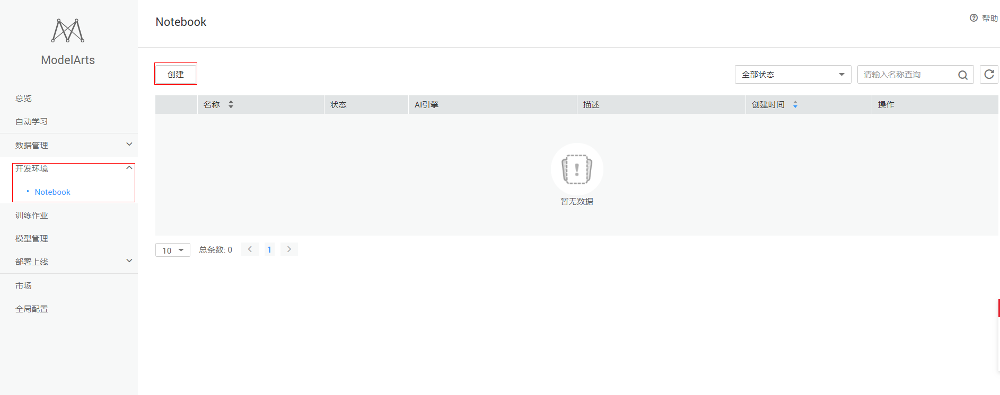

2. 输入各项参数，AI引擎决定了Notebook上的系统环境，这里选择MXNet，如图2-2所示。

   图2-2 创建NoteBook

   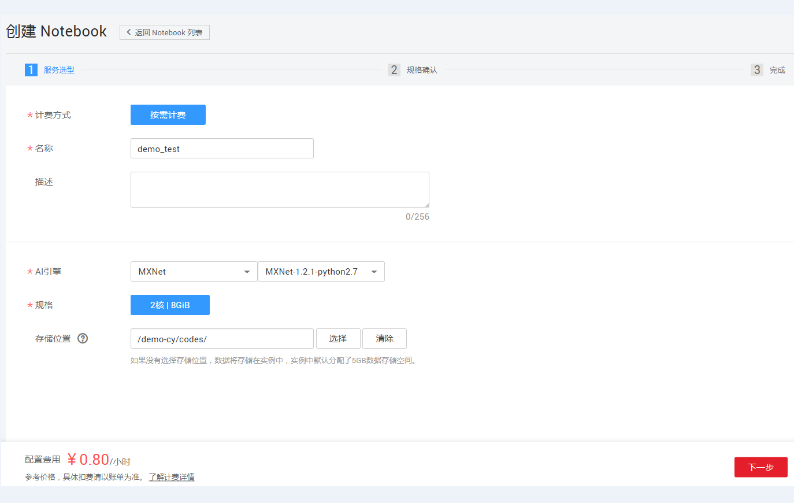

3. 等待状态变成运行中后打开，在jupyter界面可以直接打开相应文件进行更改然后保存，也可以在右上角的New中创建Python环境运行代码做调试，或者新建Terminal（linux云上开发环境）去调试代码。**同样要注意，如果不使用Notebook了之后及时停止服务，以免造成欠费。**

   图2-3 使用Notebook

   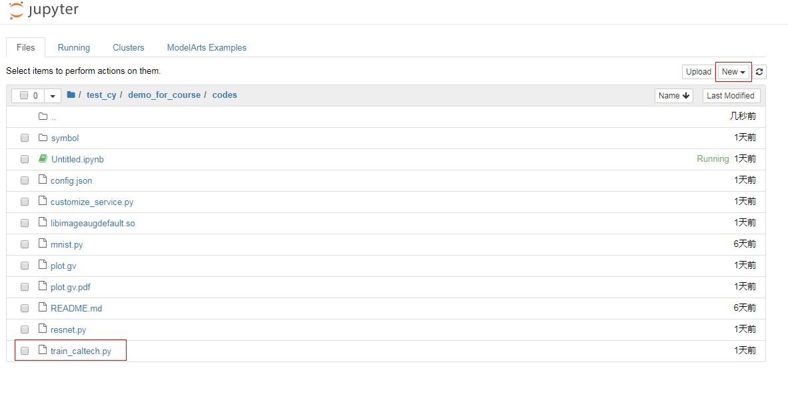
